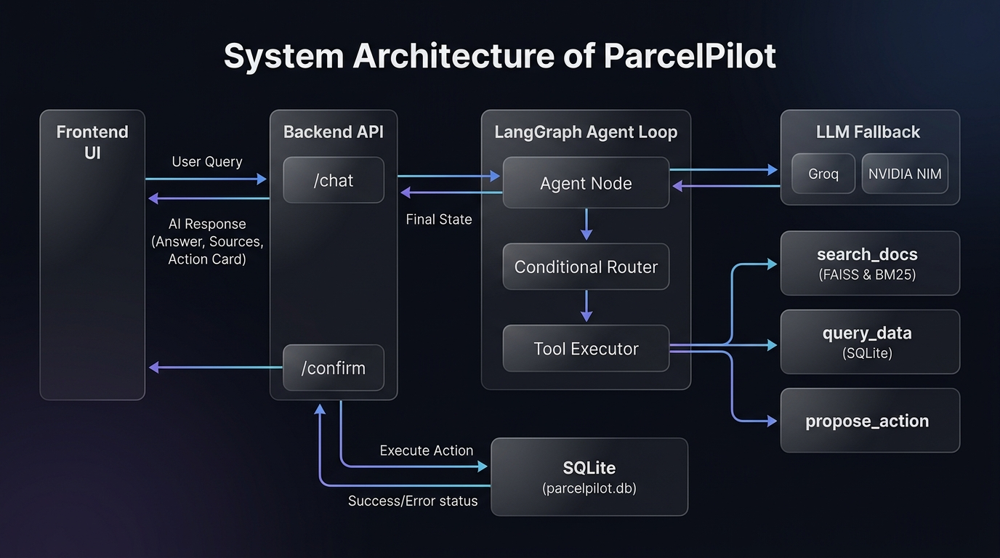
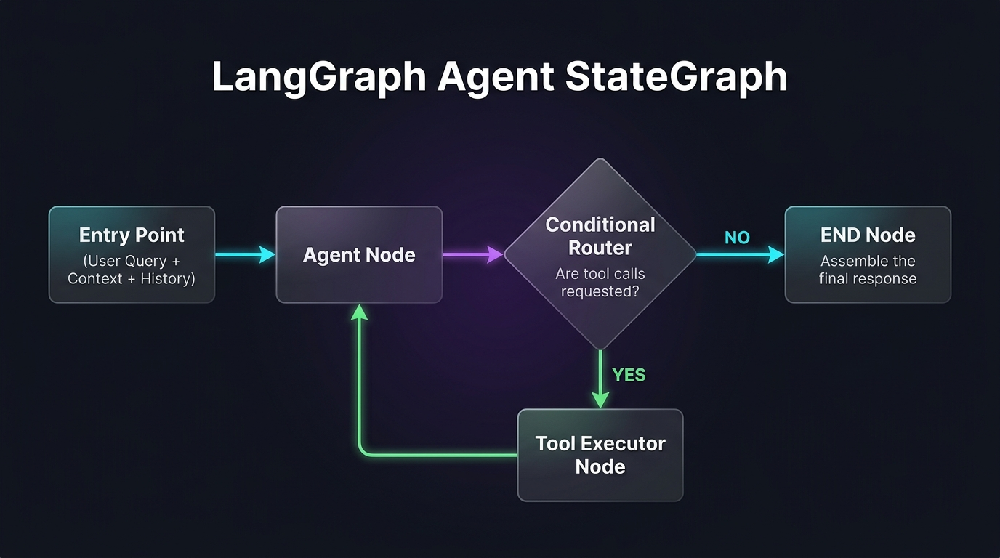

# ParcelPilot AI Support Agent

An end-to-end B2B AI Customer Support and Operations platform for **ParcelPilot** (a fictional shipping/logistics product), built for the CalQuity AI Agent Assessment. 

It contains a customer-facing support chatbot, an internal support/operations dashboard, and a stateful LangGraph agent loop with document retrieval, SQL database access control, and a safety confirmation gate.

---

## 🏗️ System Architecture & Workflow

### 1. System Design
The system consists of a Vite/React frontend chat application communicating with a FastAPI backend server. The backend runs a stateful LangGraph agent loop that utilizes tools for scoped SQL queries, hybrid PDF search, and action proposals.

The system architecture diagram is saved locally at:
📁 **`./docs/system_architecture.jpg`**



#### System Data Flow:
*   **Query Path**: The frontend sends a POST request with the user query, authenticated `account_id`, and session history to `/chat`. The API initializes the `AgentState` and passes it to the LangGraph executor.
*   **Inference & Tool calls**: The LangGraph loop queries the LLM via a dynamic fallback chain. The LLM determines if it needs tools.
*   **Database & RAG execution**: The tool executor runs the database or document tools and returns the results.
*   **AI Response Path**: When no more tools are needed, the final state is compiled and sent back to `/chat` and rendered on the user interface.
*   **Action Confirmation Path**: If an action is proposed, it is staged as a pending action. When the user clicks "Confirm", the frontend calls `/confirm`, updating the SQLite database, and returns the completion status.

### 2. LangGraph Agent StateGraph Design
The agent uses a stateful Graph (`StateGraph`) consisting of an `agent` node, a conditional router `should_continue`, and a `tool_executor` node.

The workflow diagram is saved locally at:
📁 **`./docs/agent_workflow.jpg`**



#### Graph Nodes & Logic:
1.  **Entry Point**: Receives the initial context (User query + Session history + authenticated account details).
2.  **Agent Node**: Calls the LLM fallback manager with tools bound to it. Updates the conversation state with the AI response.
3.  **Conditional Router**: Evaluates if the agent requested any tool calls:
    *   **YES**: Branches to the **Tool Executor Node**.
    *   **NO**: Branches to the **END Node** (response output).
4.  **Tool Executor Node**: Dynamically executes the requested tool(s) (`search_docs`, `query_data`, or `propose_action`), logs the results to the state, and loops back to the **Agent Node**.
5.  **END Node**: Assembles the final answer, extracts sources, and returns the response.

---

## 📂 Project File Structure
```text
CalQuity/
├── docs/                               # Architecture and workflow diagrams
│   ├── system_architecture.jpg
│   └── agent_workflow.jpg
├── backend/                            # FastAPI backend & LangGraph agent
│   ├── agent/
│   │   ├── tools/                      # Agent tools
│   │   │   ├── actions.py              # propose_action / execute_action
│   │   │   ├── query_data.py           # sqlite querying + scoped access control
│   │   │   └── search_docs.py          # FAISS + BM25 document search
│   │   ├── graph.py                    # LangGraph StateGraph builder
│   │   ├── llm.py                      # LLM fallback chain configuration
│   │   └── prompts.py                  # System prompts & scope boundaries
│   ├── data/
│   │   ├── raw/                        # Raw source documents (PDFs & Excel)
│   │   ├── processed/                  # Generated database & text chunks
│   │   └── parcelpilot.db              # SQLite Database
│   ├── indexes/                        # FAISS & BM25 index files
│   ├── ingestion/                      # Ingestion & index building scripts
│   ├── tests/                          # Tests & evaluation suite
│   │   ├── eval_cases.json             # Golden evaluation test cases
│   │   └── test_tools.py               # Deterministic unit tests (pytest)
│   ├── main.py                         # FastAPI App
│   └── requirements.txt                # Python dependencies
├── frontend/                           # React/Vite chat & operations UI
│   ├── src/                            # UI components
│   ├── index.html                      # Entry HTML page
│   └── package.json                    # Node dependencies
├── eval/                               # End-to-end evaluation runner
│   └── run_eval.py                     # Golden eval script
├── .gitignore                          # Git exclusions
└── README.md                           # Documentation (This file)
```

---

## 🌟 Key Features

### 1. Robust Account-Level Access Control (Data Privacy)
Access controls are strictly enforced at the **data/tool layer** (in Python code) rather than relying on prompts. 
*   Normal customer accounts (e.g. `ACCT-NORTHSTAR`, `ACCT-LUMENWORKS`) can only view their own orders, tickets, and contracts. Any cross-account access request immediately returns `"ACCESS DENIED"` in tool execution.
*   Internal Operations staff (`INTERNAL-OPERATIONS`) bypasses these scopes for audit and issue detection purposes.

### 2. Dual-Engine Document Search (FAISS + BM25 RAG)
Retrieves document context from policies and contracts using a hybrid retrieval architecture:
*   **FAISS Vector Search**: Encodes the query into a dense vector (using `all-MiniLM-L6-v2`) and executes a Cosine Similarity ranking over the documents to retrieve the top 5 semantically related chunks.
*   **Okapi BM25 Keyword Search**: Tokenizes the query and retrieves the top 5 lexical matching chunks (exact keyword matches).
*   **Union-Based Fusion (`all_ids = dense_ids | keyword_ids`)**: Combines the outputs of both search paths using a mathematical union. If there is zero overlap, up to 10 unique candidate chunks are selected. Deduplication is performed automatically.
*   **Scoping & Lifecycle Filtering**:
    *   **Lifespan**: Automatically discards any retrieved chunks flagged as deprecated (e.g. `Support_Policy_v2_DEPRECATED`).
    *   **Access Scope**: Validates the metadata of custom B2B agreement chunks; contract files belonging to other customer accounts are silently dropped.
*   **LLM Context Delivery**: The final permitted chunks are concatenated into a structured context string separated by `---` dividers and returned to the LLM as a single `ToolMessage` payload.


### 3. Dynamic LLM Fallback & Latency Optimization
To prevent service downtime and API rate-limiting issues:
*   Integrates a fallback chain: **Groq (Primary openai/gpt-oss-120b)** ➡️ **NVIDIA NIM (Secondary meta/llama-3.3-70b-instruct)**.
*   **Swapping Tracker**: When the primary model fails (e.g. 429 Rate Limit), the fallback model immediately takes over, and the server thread-safely caches this preference. Subsequent requests go directly to the healthy provider first, avoiding unnecessary latency.

### 4. Explicit Confirmation Gate (State-Changing Actions)
The agent cannot execute state-changing actions (like escalating a ticket or updating status) directly.
*   It stages the action using `propose_action` which returns an `action_id`.
*   The UI renders a card requiring the user to click **Confirm**.
*   Clicking **Confirm** invokes `/confirm` to execute the SQL updates in the database.

### 5. Strict Scope Boundaries
Prevents the agent from answering out-of-scope queries (like weather, capitals, current time, or general trivia). The system prompt instructs the agent to politely decline general knowledge queries and direct users back to ParcelPilot issues.

### 6. Proactive Issue Detection Dashboard
Exposes an internal ticket dashboard for support teams (`INTERNAL-OPERATIONS`) showing open/escalated tickets, customer priority levels, and approaching deadlines to track SLAs.

---

## 🛠️ Technology Stack
*   **Core**: HTML, CSS, JavaScript
*   **Frontend**: Vite, React, Vanilla CSS
*   **Backend**: FastAPI (Python 3.13)
*   **Agent Framework**: LangGraph, LangChain Core
*   **RAG Engine**: FAISS (Vector database), Rank-BM25 (Lexical database), HuggingFace SentenceTransformers
*   **Database**: SQLite (relational storage)

---

## 🚀 Local Installation & Running Instructions

### 1. Setup Backend
1.  Navigate to the `backend` folder:
    ```bash
    cd backend
    ```
2.  Activate the virtual environment:
    *   **Windows (PowerShell)**:
        ```bash
        .\venv\Scripts\Activate.ps1
        ```
    *   **Mac/Linux**:
        ```bash
        source venv/bin/activate
        ```
3.  Install Python dependencies:
    ```bash
    pip install -r requirements.txt
    ```
4.  Configure environment variables:
    Copy `.env.example` to `.env` and fill in your keys:
    ```bash
    # Fill GROQ_API_KEY and NVIDIA_API_KEY
    ```

### 2. Ingestion (One-time Setup)
Run the following scripts in order to ingest the source data and build indices:
```bash
python ingestion/ingest_xlsx.py          # XLS data -> SQLite
python ingestion/chunk_pdfs.py           # PDFs -> chunks
python ingestion/build_faiss_index.py    # chunks -> FAISS index
python ingestion/build_bm25_index.py     # chunks -> BM25 index
```

### 3. Start Backend Server
Run the FastAPI development server:
```bash
uvicorn main:app --reload
```
The API docs will be available at `http://localhost:8000/docs`.

### 4. Setup Frontend
1.  Open a new terminal and navigate to the `frontend` folder:
    ```bash
    cd frontend
    ```
2.  Install Node dependencies:
    ```bash
    npm install
    ```
3.  Start Vite dev server:
    ```bash
    npm run dev
    ```
    The application will run locally at `http://localhost:5173`.

---

## 🧪 Testing and Evaluation

### 1. Run Deterministic Unit Tests (No LLM Calls)
These verify SQLite scoping, access control, and tool functions.
```bash
cd backend
pytest tests/test_tools.py -v
```

### 2. Run End-to-End Golden Evaluations (Requires running Backend)
Runs the test cases in `eval_cases.json` against the API to output a performance score.
```bash
# Run from the workspace root directory:
python eval/run_eval.py
```

---

## 🚀 Deployment & Troubleshooting Notes

### ⚠️ Render Free Tier Out-Of-Memory (OOM)
* **Problem**: When deploying the backend Web Service on the Render Free Tier (512MB RAM limit), the service would fail during the startup phase with an `Out of memory (used over 512Mi)` error.
* **Root Cause**: Heavy ML libraries like `torch` (PyTorch) and `sentence-transformers` load large shared files into memory immediately upon module-level import. This exceeded the 512MB RAM threshold before `uvicorn` could bind to its port.
* **Resolution (No `requirements.txt` changes)**:
  1. **Lazy Loading**: Modified [`backend/agent/tools/search_docs.py`](file:///c:/Users/girdh/Desktop/CalQuity/backend/agent/tools/search_docs.py) to import `faiss` and `sentence-transformers` dynamically inside the tool's execution thread (`_load()` function) instead of globally. This keeps initial FastAPI startup memory under 100MB.
  2. **Thread Limits**: Configured PyTorch to use a single execution thread (`OMP_NUM_THREADS = 1`) and disabled gradient calculation (`torch.set_grad_enabled(False)`), reducing active memory consumption to fit within the free tier bounds.

